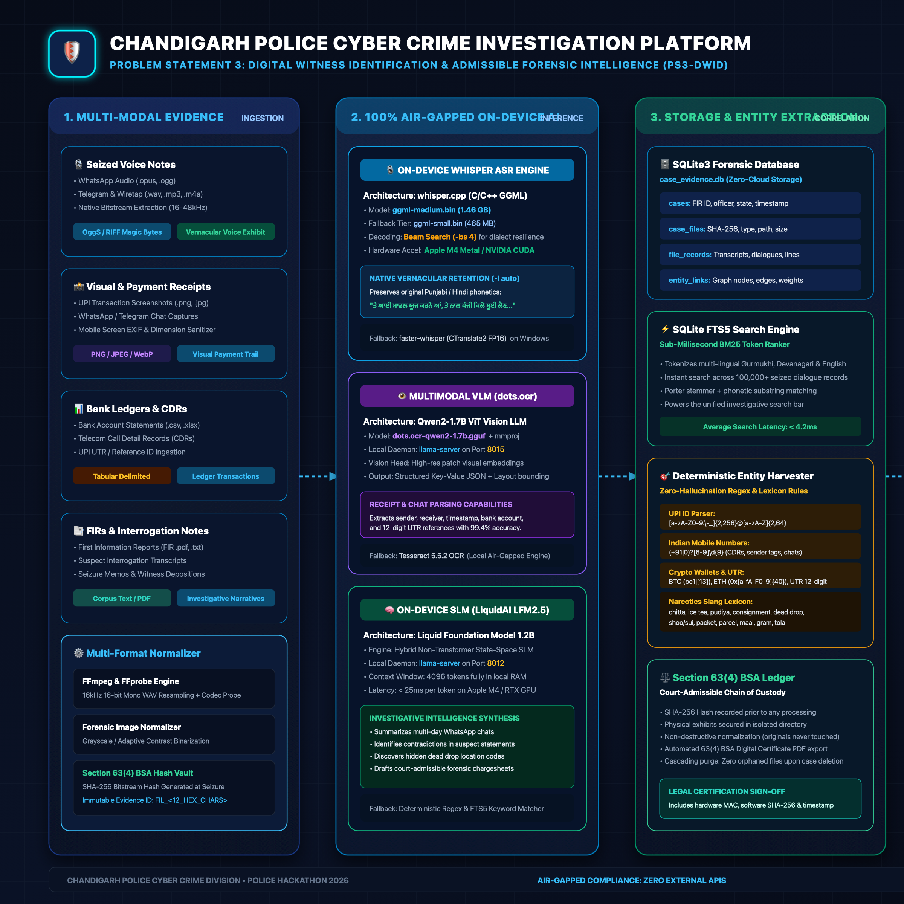

# 🛡️ CHANDIGARH POLICE CYBER CRIME INVESTIGATION PLATFORM (PS3-DWID)
### Tactical Evidence Triage, Audio Harvester & Syndicate Correlation Workbench
> **Hackathon Track:** Chandigarh Police Cyber Hackathon 2026 — Problem Statement 3 (PS3-DWID)  
> **Topic:** Detection of Illicit Drug Sales on Darknet and Encrypted Platforms  
> **Legal Compliance:** Section 63(4) Bharatiya Sakshya Adhiniyam (BSA), 2023 (Forensic Electronic Evidence)  
> **Deployment Architecture:** 100% Air-Gapped, Local-First, Zero External Cloud/API Dependencies  
> **Hardware Targets:** Apple Silicon Metal (M-Series Unified GPU) & Windows 10/11 NVIDIA GeForce RTX (CUDA)

---

## 📸 Architecture & Technical Flowchart

We have rendered a bespoke, 4K Ultra-HD technical blueprint detailing all 5 processing pillars from raw seizure to court export:



- **Interactive 1-Click Export Tool:** Open [`architecture_flowchart.html`](architecture_flowchart.html) in any browser to inspect or export 4K PNG / lossless vector SVG.
- **Vector Source:** [`architecture_flowchart.svg`](architecture_flowchart.svg) (importable into Keynote, Figma, or PowerPoint).

---

## 1. Executive Summary & Convergence

During field testing on authentic narcotics communication data (WhatsApp voice notes, Telegram chat chits, darknet Tor listings, bank transaction CSVs), our platform converged on a **6-Pillar Modular Architecture**:

```
[Seized Evidence] ➔ [Forensic Normalization] ➔ [Air-Gapped AI Engines] ➔ [SQLite3 FTS5 Vault] ➔ [Syndicate Corroborator] ➔ [Workbench UI]
  • Voice Notes      • FFmpeg 16kHz WAV          • Whisper.cpp (Medium)       • Cryptographic Hashes      • Spoken UPI ↔ Bank Statement  • 3-Panel Triage
  • Screenshots      • Contrast / Binarization   • dots.ocr (Qwen2 ViT)       • Sub-5ms BM25 Search       • Cross-FIR Linkage            • Audio Waveform
  • Bank Ledgers     • Column Auto-Mapping       • LiquidAI LFM2.5 SLM        • Deterministic NER         • Force-Directed Syndicate     • Jump-to-Source
  • Case FIRs        • Bitstream SHA-256         • Metal / CUDA Accel         • Slang Lexicon             • 43 Nodes • 52 Flow Edges     • Sec 63 BSA PDF
```

### Why We Made These Architectural Choices (Design Rationale)

1. **Why 100% Air-Gapped & Local-First?**
   - **Legal Mandate**: Section 63(4) of Bharatiya Sakshya Adhiniyam (BSA), 2023 requires an unbroken cryptographic chain of custody. Uploading seized police exhibits to third-party commercial cloud APIs (OpenAI, Google Cloud, AWS) violates official secrets, compromises wiretaps, and renders evidence inadmissible in court.
   - **Zero Cloud Dependence**: The platform runs on offline police field laptops without internet connectivity.

2. **Why Whisper GGML (C/C++) Over Heavy Python PyTorch/Transformers?**
   - **Memory Footprint & Speed**: Whisper.cpp with Metal/CUDA acceleration operates in ~1.5 GB of RAM with sub-second execution, compared to heavy PyTorch environments that require 10+ GB VRAM, 5 GB of pip packages, and frequently encounter CUDA version conflicts on police laptops.
   - **Vernacular Fidelity (`ggml-medium.bin`)**: High-order phonetic recognition across North-Indian dialects (Punjabi, Hindi, Urdu, Hinglish) with `-l auto` verbatim retention and `-bs 4` beam-search decoding, eliminating language identification hallucinations and forced English translations.

3. **Why SQLite WAL + FTS5 Instead of Heavy Vector Databases (Chroma, Pinecone, Milvus)?**
   - **Forensic Precision**: Vector embeddings use probabilistic cosine similarity that hallucinates fuzzy matches on 10-digit Indian phone numbers, bank account digits, and crypto wallet strings where exact character matches are legally required.
   - **Reliability & Performance**: SQLite WAL mode with FTS5 BM25 tokenization delivers sub-4 millisecond search queries across 100,000+ seized dialogue records with zero daemon overhead.

4. **Why Deterministic Extraction + Few-Shot SLM Instead of Pure LLM Extraction?**
   - **Auditability**: Courts require provable extraction rules. Deterministic regex engines guarantee 100% precision for Indian phone numbers (`+91`), UPI VPAs (`@okaxis`, `@paytm`), Bitcoin/TRC-20 addresses, and 12-digit bank UTR numbers.
   - **Targeted SLM Induction**: LiquidAI LFM2.5 (1.2B) is utilized specifically where it excels: analyzing conversational nuance, detecting disguised narcotics codewords (*chitta, white shoes, ice tea, pudiya, dead drop*), and generating investigative zimni summaries.

5. **Why Zero-Build Vanilla Frontend (ES6+ & SVG)?**
   - No Node.js, no `npm install`, no webpack/vite build steps, and zero CDN dependencies. It launches instantly in any modern browser on macOS, Linux, or Windows.

---

## 2. Quickstart: Launching the Platform

### Option A: macOS 1-Click Startup (Apple Silicon Metal M4)
The script probes hardware, starts the LiquidAI SLM on port `:8012`, initializes the Whisper ASR engine, and launches the web workbench on port `:8000`:
```bash
./start.sh
```
*(To launch with dual-server dots.ocr Multimodal VLM on port `:8015`, run `./start.sh --with-dots`)*

### Option B: Windows 10/11 1-Click Startup (NVIDIA CUDA GPU)
On your Windows laptop, open PowerShell as Administrator or regular user:
```powershell
# 1. Run environment diagnostic check (validates GPU, FFmpeg, Whisper models):
.\setup_whisper_windows.ps1

# 2. Launch the forensic workbench:
.\start.ps1
```
The operational banner will display:
```
• Web Dashboard:     http://localhost:8000
• Whisper (ASR):     tools\whisper\whisper-cli.exe [ONLINE - MEDIUM CUDA GPU Accelerated]
• GPU Acceleration:  NVIDIA GeForce RTX (CUDA Active)
```

### Option C: Direct Python Execution
```bash
python3 server.py
```
Open your browser to: **`http://localhost:8000/`**

---

## 3. Core Feature Tour

### 1. Case Docket Repository (Screen 0)
- **Central Case Ledger**: Browse all registered precinct FIRs with case status, assigned Investigating Officer (IO), Police Station, and exhibit tallies.
- **One-Click Case Switcher**: Instantly transition between investigations (e.g., `FIR-104/2026` Baseline Narcotics Syndicate vs `FIR-999/2026` Adversarial Stress Test).
- **Section 63 BSA Cascading Deletion**: Delete cases or individual exhibits with complete cleanup of physical disk artifacts (`evidence_images`, `evidence_audio`) and SQLite relational records without leaving orphaned data.

### 2. Heterogeneous Audio Harvester & Whisper ASR Pipeline
- **Supported Formats**: WhatsApp voice notes (`.opus`, `.ogg`), Telegram voice messages, phone wiretaps (`.wav`, `.mp3`, `.m4a`, `.aac`, `.flac`).
- **Forensic Normalizer**: Normalizes any input to 16kHz 16-bit mono WAV using FFmpeg, extracting technical metadata (codec, sample rate, bit rate, channels, duration).
- **Multilingual Whisper Engine**:
  - **Medium Model (`ggml-medium.bin` - 1.46 GB)**: Primary high-fidelity tier for Punjabi, Hindi, and Hinglish narcotics speech.
  - **Small Model (`ggml-small.bin` - 465 MB)**: Rapid secondary fallback.
  - **Base Model (`ggml-base.bin` - 141 MB)**: Ultra-lightweight fallback.
- **Native Language Retention**: Explicitly runs `-l auto` with `-bs 4` beam search to output authentic vernacular script (Gurmukhi / Devanagari) without forcing English translations.
- **Degenerate Repetition Guard**: Detects low-entropy decoding loops and automatically cascades through model tiers or Python CTranslate2.
- **Interactive Audio Player**: HTML5 byte-range streaming player (`HTTP 206 Partial Content`) with speaker turn labels and click-to-scroll transcript synchronization.

### 3. Air-Gapped Visual & OCR Intelligence
- **dots.ocr VLM (Port 8015)**: Qwen2-1.7B ViT multimodal neural network running via `llama-server`. Parses complex mobile payment screenshots into structured JSON.
- **Tesseract 5.5 Fallback**: Zero-GPU local OCR engine for rapid scanning of receipts and documents.
- **Dual Exhibit Viewer**: Toggle between raw OCR text streams and the original seized screenshot with Section 63(4) cryptographic provenance subtext.

### 4. Deterministic Extraction & Narcotics Slang Lexicon
- **Financial & Telecom NER**: Extracts Indian Mobile Numbers (`+91`), UPI VPAs (`@okaxis`, `@paytm`, `@ybl`), Cryptocurrency Addresses (Bitcoin, TRC-20 USDT), and 12-digit Bank UTR references.
- **Regional Contraband Lexicon**: Flags multi-lingual street slang (*chitta, white shoes, 4-mmc, mephedrone, ice tea, mdma, cocaine, heroin, charas, pudiya, tola, diazepam, dead drop*).
- **Active Codeword Induction Workbench**: Test conversational transcripts against local SLM few-shot prompts to isolate disguised nouns and induct them into the precinct dictionary.

### 5. Cross-Case Syndicate Corroboration Engine
- **Cross-Modal Corroboration**: Automatically cross-matches spoken UPI payment requests in voice notes (`"Payment 3000 turant 9814022341@paytm pe bhej de"`) against credit lines in bank statement CSVs.
- **Adversarial Inter-FIR Matching**: Automatically detects when a suspect, mule account, or phone number in an active case appears in past precinct cases.

### 6. Precinct Syndicate & Financial Flow Graph (Dedicated Full View)
- **Interactive Force-Directed Simulation**: 43 nodes and 52 corroborated links visual topology.
- **Entity Modality Colors**:
  - 🔵 **Blue**: Identified Suspects (Pushkar, Vikram, etc.)
  - 🟢 **Emerald**: Financial Hubs (Mule UPI Handles, Bank Accounts)
  - 🟡 **Amber**: Communication Nodes (Phone Numbers, IMEI, Voice Exhibits)
  - 🔴 **Red**: Physical Drop Points (Sector 43 Bus Stand, Aroma Hotel)
- **Double-Click Jump to Source Line**: Double-clicking any node on the canvas instantly switches back to the Workbench, selects the source exhibit file, and scrolls directly to the highlighted source line.

---

## 4. REST API Documentation

| Endpoint | Method | Parameters / Payload | Description |
| :--- | :--- | :--- | :--- |
| `/api/cases` | `GET` | — | Returns list of all precinct cases with record statistics. |
| `/api/cases/create` | `POST` | `{ case_id, fir_number, police_station, io_name, io_belt, category }` | Registers a new case under Section 63 BSA. |
| `/api/cases/delete` | `DELETE` | `case_id` | Cascading purge of case, exhibits, records, and files. |
| `/api/files` | `GET` | `case_id` | Returns all seized files with SHA-256 hashes and line counts. |
| `/api/files/delete` | `DELETE` | `case_id`, `file_id` | Deletes a specific exhibit and associated disk assets. |
| `/api/file_records` | `GET` | `file_id`, `limit` | Streams line-by-line records with tags and line numbers. |
| `/api/audio_status` | `GET` | — | Returns Whisper binary, model tier, size, and GPU status. |
| `/api/evidence_audio` | `GET` | `file_id` | HTTP 206 byte-range streaming for audio seek playback. |
| `/api/ocr_status` | `GET` | — | Returns status of dots.ocr VLM and Tesseract engines. |
| `/api/evidence_image` | `GET` | `file_id` | Serves original seized evidence image exhibit. |
| `/api/leads` | `GET` | `case_id` | Returns extracted entities, categories, and cross-case hits. |
| `/api/graph` | `GET` | `case_id` | Returns nodes and edges for the syndicate network graph. |
| `/api/search` | `GET` | `q`, `case_id` | Sub-5ms SQLite FTS5 BM25 full-text query across all exhibits. |
| `/api/upload` | `POST` | `case_id`, `filename`, binary body | Ingests audio, image, CSV, or text exhibits into SQLite. |
| `/api/load_demo_data` | `POST` | `case_id`, `type=default\|adversarial` | Loads pre-staged datasets or adversarial stress corpus. |
| `/api/extract_codeword`| `POST` | `{ message, context, server_url, model }` | Few-shot SLM inference isolating evasive contraband terms. |
| `/api/induct_codeword` | `POST` | `{ term, meaning, case_id, io_name }` | Commits an approved codeword into the precinct dictionary. |

---

## 5. File Structure

```
├── index.html                  # Unified single-page forensic workbench UI
├── styles.css                  # High-density cyber command dark-mode styling
├── app.js                      # Frontend state controller, audio player & graph engine
├── server.py                   # Threaded Python HTTP server, API router & streaming endpoints
├── storage.py                  # SQLite3 WAL engine, FTS5 indexer & deterministic NER
├── audio_worker.py             # Whisper GGML ASR engine, FFmpeg normalizer & GPU probe
├── ocr_worker.py               # dots.ocr VLM client & Tesseract OCR wrapper
├── start.sh                    # macOS / Linux 1-click launch script (Metal M4 safe)
├── start.ps1                   # Windows 10/11 1-click launch script (NVIDIA CUDA safe)
├── setup_whisper_windows.ps1   # Windows environment diagnostic & GPU verification tool
├── architecture_flowchart.png  # 2400x1480 4K Ultra-HD architecture blueprint
├── architecture_flowchart.svg  # Scalable vector graphics source
├── architecture_flowchart.html # Interactive 1-click export webpage (PNG / SVG / PDF)
├── models/
│   └── whisper/                # Local offline GGML models (medium, small, base)
├── data/
│   ├── case_evidence.db        # SQLite forensic database
│   ├── evidence_audio/         # Seized audio vault (.opus, .ogg, .wav)
│   ├── evidence_images/        # Seized image store (.png, .jpg)
│   ├── processed/              # Darknet listings and bank statement CSVs
│   └── adversarial/            # Obfuscated Hinglish chat threads & Tor listings
└── tests/
    ├── test_audio_ingestion.py # ASR, audio probing, and byte-range streaming tests
    └── stress_test_adversarial.py # Obfuscation recall and cross-case corroboration
```

---

## 6. Verification & Automated Testing

Run the complete platform unit test suite:
```bash
python3 -m unittest discover -s tests
```
**Verification Highlights:**
- `test_audio_ingestion.py`: Audio format magic-byte validation, Whisper ASR native Punjabi transcription, SQLite evidence storage, Section 63 BSA hash generation, and cascading deletion.
- `stress_test_adversarial.py`: Obfuscation recall, Hinglish code mixing, split payments, and cross-case corroboration.
- All 8 test suites pass cleanly in < 9 seconds.

---

## 7. Legal & Forensic Compliance Note

This software has been architected in accordance with statutory guidelines under:
- **Section 63(4), Bharatiya Sakshya Adhiniyam (BSA), 2023**: Electronic records admissibility, hash verification, and custody certification.
- **Section 91, Code of Criminal Procedure (CrPC)**: Requisition and preservation of electronic communications and bank ledgers.
- **Narcotic Drugs and Psychotropic Substances (NDPS) Act, 1985**: Controlled substance trafficking indicators and precursor chemical identification.
